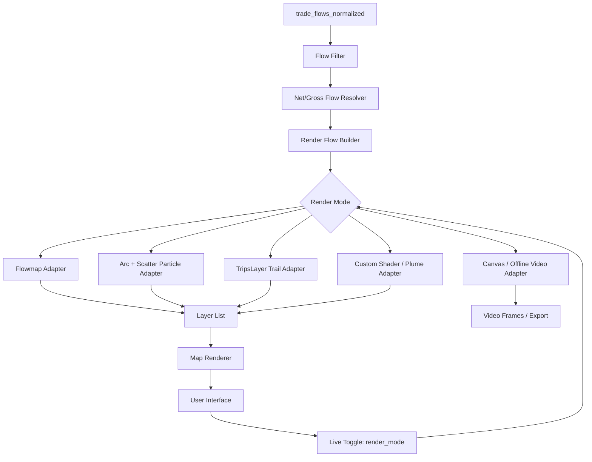

# Particle Rendering Module for Global Commodity Trade Atlas

**Stand:** 2026-04-29  
**Zweck:** Architektur- und Ideendokument für die Erweiterung des stabilen MVP v0.1 um echte Partikel-, Trail- und plumeartige Handelsstrom-Renderings.  
**Arbeitsname:** *Commodity Particle Engine — drei Lehm gegen zwei Schaf, aber jedes Schaf ist ein WebGL-Sprite.*

---

## 1. Ausgangslage

Der aktuelle MVP v0.1 rendert bereits stabile Commodity-Flows auf einer Weltkarte, aktuell im Stil:

```text
Trade-only-Prototyp
→ ausgewählte Commodity
→ Nettoflüsse / Handelsflüsse
→ Flowmap-/Linienrendering
→ Tooltip, Legende, Kennzahlen
```

Das ist ein sehr guter erster Schritt. Die App zeigt, dass das Basismodell funktioniert: Daten laden, Commodity auswählen, Flüsse filtern, Flüsse visualisieren.

Der nächste Schritt ist nicht einfach „hübschere Pfeile“, sondern ein eigener Visualisierungslayer für **Materialströme als bewegte Partikelfahnen**.

Zielbild:

```text
Quelle emittiert Partikel
→ Partikel bewegen sich entlang grober Handelsrichtung
→ Partikeldichte zeigt Flussstärke
→ aus vielen Punkten entsteht eine Fahne / ein Strom / ein Rauchplume
→ optionale Trails erzeugen sichtbare Bewegungsmasse
```

Wichtig: Der Render-Layer darf das Kernmodell nicht verformen. Die Datenarchitektur muss zukunftssicher bleiben für:

- Quellen- und Produktionslayer,
- Senken- und Nutzungslayer,
- Transformations- und Prozesslayer,
- Schockanalyse,
- Auswertungslayer,
- verschiedene Render-Engines.

Merksatz:

> Das Kernmodell liefert neutrale Flussdaten. Der Renderer entscheidet nur, wie sie aussehen.

---

## 2. Zentrale Architekturentscheidung

Das Projekt braucht eine Trennung zwischen:

```text
Core Data Model
→ Render Preparation
→ Render Adapter
→ User Interface Toggle
```

Nicht so:

```text
BACI-Daten direkt in irgendeinen Kartenlayer stopfen
```

Sondern so:

```text
trade_flows_normalized
→ render_flows
→ renderer-specific data
→ layer list
```

Damit kann später derselbe Handelsfluss wahlweise als Flowmap-Linie, Arc, Punktstrom, Trail-Strom, Dichtefahne oder Videoexport gerendert werden.

---

## 3. Begriffe

### 3.1 Flow

Ein Flow ist ein aggregierter Handelsstrom:

```text
exporter → importer × commodity × year × quantity
```

Beispiel:

```text
United States → Morocco × ammonia × 2024 × 1.1 million tonnes
```

### 3.2 Particle

Ein Particle ist eine visuelle Repräsentation einer Teilmenge dieses Flows.

Beispiel:

```text
1 particle = 10,000 tonnes ammonia
```

Das ist eine **Render-Konvention**, keine neue Datenquelle.

### 3.3 Trail

Ein Trail ist eine kurze Nachspur hinter einem bewegten Partikel. Trails erzeugen den Eindruck von Geschwindigkeit, Masse und Rauch.

### 3.4 Plume

Ein Plume ist keine einzelne Linie, sondern eine **Dichtefahne**. Sie entsteht aus vielen Partikeln, Jitter, Transparenz, Trails und optionaler Dichteglättung.

Mentales Bild:

```text
nicht Pfeil
sondern Rauchfahne / Staubspur / Satellitenbild von Feuerrauch
```

### 3.5 Flowmap vs. Flowchart

**Flowmap** = Karte mit Bewegungsflüssen zwischen Orten.  
**Flowchart** = Ablaufdiagramm.

Im Gespräch war wahrscheinlich „Flowmap“ gemeint. Trotzdem enthält dieses Dokument zusätzlich ein Mermaid-Flowchart für die Modularchitektur.

---

## 4. Modul-Flowchart



---

## 5. Render-Modi als Live-Schalter

Die App sollte einen Render-Schalter bekommen:

```text
render_mode:
  - flowmap_lines
  - arc_particles
  - trips_trails
  - plume_density_experimental
  - static_arcs_debug
```

Optional zusätzlich:

```text
flow_mode:
  - gross
  - net

particle_scale_mode:
  - linear_capped
  - sqrt
  - log

trail_mode:
  - off
  - short
  - long

jitter_mode:
  - none
  - light
  - plume
```

### 5.1 Live-Umschaltung

Ja, das sollte möglich sein, wenn die App sauber modular gebaut wird.

Die App-Logik sollte nicht die Rohdaten neu laden, sondern nur den Render-Adapter wechseln:

```text
selected_commodity bleibt gleich
selected_year bleibt gleich
render_flows bleiben gleich
nur layer_factory(render_mode) ändert sich
```

### 5.2 Ziel-API

Pseudocode:

```ts
type RenderMode =
  | 'flowmap_lines'
  | 'arc_particles'
  | 'trips_trails'
  | 'plume_density_experimental'
  | 'static_arcs_debug';

function buildLayers(params: {
  renderMode: RenderMode;
  renderFlows: RenderFlow[];
  locations: LocationTable;
  time: number;
  renderConfig: RenderConfig;
}) {
  switch (params.renderMode) {
    case 'flowmap_lines':
      return buildFlowmapLayers(params);
    case 'arc_particles':
      return buildArcParticleLayers(params);
    case 'trips_trails':
      return buildTripsLayers(params);
    case 'plume_density_experimental':
      return buildPlumeLayers(params);
    case 'static_arcs_debug':
      return buildStaticArcLayers(params);
  }
}
```

---

## 6. Gemeinsame Renderdaten

Alle Render-Adapter sollen möglichst dasselbe neutrale Inputformat nutzen.

### 6.1 Tabelle oder Objekt: `render_flows`

```text
flow_id
commodity_id
commodity_group
year
origin_id
origin_name
origin_lon
origin_lat
destination_id
destination_name
destination_lon
destination_lat
quantity_tonnes
value_usd
flow_direction_mode
is_net_flow
abs_quantity_tonnes
signed_quantity_tonnes
rank_global
color_rgba
```

### 6.2 Tabelle oder Objekt: `render_particles`

Diese Tabelle muss nicht dauerhaft gespeichert werden. Sie kann aus `render_flows` generiert werden.

```text
particle_id
flow_id
commodity_id
origin_lon
origin_lat
destination_lon
destination_lat
start_time
duration
phase
mass_tonnes
radius
color_rgba
jitter_seed
path_variant
```

### 6.3 Trennung der Ebenen

```text
trade_flows_normalized = analytische Wahrheit
render_flows = visuell vorbereitete Wahrheit
render_particles = synthetische Darstellung
```

Wichtig:

> Partikel sind Visualisierung, keine neue empirische Beobachtung.

---

## 7. Ansatz A: Flowmap.gl als schneller Linien-/Animationstest

### 7.1 Idee

**flowmap.gl** ist ein Flowmap-Layer für deck.gl. Es visualisiert Bewegungen zwischen geografischen Orten, zum Beispiel Migration, Güter oder sonstige Flüsse. Es ist WebGL-basiert und für größere Flow-Daten gedacht.

Dieser Ansatz ist gut als schneller Baseline-Renderer:

```text
render_mode = flowmap_lines
```

### 7.2 Was er gut kann

- stabile Flow-Linien,
- adaptive Aggregation,
- interaktive Tooltips,
- gute Lesbarkeit für klassische Flowmaps,
- schneller Vergleichsmodus,
- Live-Schalter relativ einfach.

### 7.3 Was er nicht ideal kann

- keine frei steuerbare Partikelwolke,
- keine echte Rauchfahne,
- Linien bleiben visuell dominant,
- Partikelanimation, falls aktiviert, ist eher Linien-Effekt als eigenständige Materialwolke.

### 7.4 Einsatz im MVP

Flowmap.gl bleibt als **Fallback- und Vergleichsrenderer** wertvoll.

Empfohlene Rolle:

```text
flowmap_lines = debug/overview/baseline
arc_particles = eigentlicher nächster Schritt
```

### 7.5 Adapter-Skizze

```ts
function buildFlowmapLayers({renderFlows, locations, renderConfig}) {
  return [
    new FlowmapLayer({
      id: 'flowmap-lines',
      data: {
        locations,
        flows: renderFlows
      },
      getLocationId: d => d.id,
      getLocationLat: d => d.lat,
      getLocationLon: d => d.lon,
      getFlowOriginId: d => d.origin_id,
      getFlowDestId: d => d.destination_id,
      getFlowMagnitude: d => d.abs_quantity_tonnes,
      animationEnabled: renderConfig.flowmap.animationEnabled,
      clusteringEnabled: renderConfig.flowmap.clusteringEnabled
    })
  ];
}
```

---

## 8. Ansatz B: Arc/GreatCircle + ScatterplotLayer als eigene Partikelmaschine

### 8.1 Idee

Dies ist der wichtigste Ansatz für unser Zielbild.

Wir zeichnen optional dezente Hintergrundrouten und rendern darüber echte bewegte Partikel.

```text
ArcLayer oder GreatCircleLayer = Route / Korridor
ScatterplotLayer = aktuelle Partikelpositionen
```

Der Ansatz ist modular, deck.gl-nativ und live umschaltbar.

### 8.2 Warum dieser Ansatz wahrscheinlich der beste nächste Schritt ist

- Volle Kontrolle über Partikelanzahl.
- Volle Kontrolle über Jitter, Geschwindigkeit, Zielstreuung und Startstreuung.
- Gute Integration in bestehende deck.gl-App.
- Gleiche Datenbasis wie aktueller MVP.
- Live-Schalter möglich, weil nur Layer ausgetauscht werden.
- Später erweiterbar zu Trails und Plumes.

### 8.3 Renderprinzip

```text
1. Nimm render_flows.
2. Erzeuge pro Flow N synthetische Partikel.
3. Jedes Partikel erhält Startzeit, Dauer, Zufallsseed und Pfadvariante.
4. Pro Frame wird Position entlang des Pfads berechnet.
5. ScatterplotLayer rendert die aktuellen Positionen.
6. Optional ArcLayer rendert schwache Hintergrundrouten.
```

### 8.4 Datenumwandlung

```ts
function generateParticles(renderFlows, config) {
  return renderFlows.flatMap(flow => {
    const n = computeParticleCount(flow.abs_quantity_tonnes, config);
    return range(n).map(i => ({
      particle_id: `${flow.flow_id}_${i}`,
      flow_id: flow.flow_id,
      commodity_id: flow.commodity_id,
      origin: [flow.origin_lon, flow.origin_lat],
      destination: [flow.destination_lon, flow.destination_lat],
      start_time: seededRandom(flow.flow_id, i) * config.loopDuration,
      duration: config.minDuration + seededRandom(i, flow.flow_id) * config.durationSpread,
      phase: seededRandom(flow.flow_id, i + 12345),
      mass_tonnes: flow.abs_quantity_tonnes / n,
      radius: computeParticleRadius(flow, config),
      color_rgba: flow.color_rgba,
      jitter_seed: seededRandom(flow.flow_id, i + 999),
      path_variant: seededRandom(flow.flow_id, i + 777)
    }));
  });
}
```

### 8.5 Positionsberechnung

Minimal für Version 0.2:

```ts
function particlePosition(particle, currentTime) {
  const tRaw = ((currentTime - particle.start_time) % particle.duration) / particle.duration;
  const t = smoothstep(0, 1, tRaw);

  const base = interpolateGreatCircle(
    particle.origin,
    particle.destination,
    t
  );

  const jitter = computePlumeJitter(particle, t);

  return [
    base[0] + jitter.lon,
    base[1] + jitter.lat
  ];
}
```

### 8.6 Plume-Jitter

Damit keine sterilen Linien entstehen:

```text
Startpunkt leicht streuen.
Zielpunkt leicht streuen.
Pfadmitte stärker streuen.
Geschwindigkeit leicht variieren.
Partikelgröße leicht variieren.
```

Ein einfaches Jitter-Profil:

```text
jitter_strength(t) = sin(pi * t)
```

Bedeutung:

- nahe Quelle wenig Streuung,
- in der Mitte mehr Streuung,
- nahe Ziel wieder weniger Streuung.

Für Migration-ähnliche diffuse Ankunft könnte man Zielstreuung erhöhen. Für Warenflüsse eher geringer halten.

### 8.7 Hintergrundrouten

Optional:

```text
ArcLayer / GreatCircleLayer mit sehr niedriger Opazität
```

Ziel:

- Orientierung,
- Debugging,
- Lesbarkeit bei wenigen Partikeln.

Später kann der User Hintergrundrouten ausblenden:

```text
show_routes: true / false
```

### 8.8 Live-Schalter

Dieser Ansatz ist sehr gut live umschaltbar:

```text
flowmap_lines ↔ arc_particles ↔ static_arcs_debug
```

Beim Umschalten:

- gleiche `render_flows`,
- Partikel eventuell neu generieren,
- Layerliste austauschen,
- Map-View bleibt erhalten.

### 8.9 Performance-Hinweise

Nicht pro Frame 100.000 JavaScript-Objekte komplett neu erzeugen.

Besser:

```text
Particles einmal erzeugen.
currentTime als uniform/state ändern.
Positionsberechnung idealerweise GPU-seitig oder effizient gecached.
Für ersten Prototyp darf CPU-seitig berechnet werden, solange Partikelzahl niedrig bleibt.
```

Empfohlene Testgrößen:

```text
10,000 particles = sicherer erster Test
50,000 particles = realistischer MVP-Test
100,000 particles = Grenze auf ThinkPad testen
> 250,000 particles = erst nach Optimierung
```

---

## 9. Ansatz C: TripsLayer als Trail-Renderer

### 9.1 Idee

Der deck.gl `TripsLayer` rendert animierte Pfade mit Zeitstempeln und Trail-Länge. Er ist ursprünglich für Fahrzeug- oder Bewegungsrouten gedacht.

Für uns kann jeder synthetische Partikel-Trip so aussehen:

```text
origin → intermediate points → destination
```

mit Zeitstempeln:

```text
t0, t1, t2, ..., tn
```

### 9.2 Vorteil

- eingebaute Zeitlogik,
- eingebaute Trails,
- sehr gute Wirkung für leuchtende Pfade,
- weniger eigene Animationslogik.

### 9.3 Nachteil

- wirkt eher wie bewegte Linien/Trails als einzelne Punktwolke,
- Daten können groß werden, wenn jedes Partikel ein eigener Trip mit vielen Stützpunkten ist,
- weniger frei als eigener Scatterplot-Partikelrenderer.

### 9.4 Gute Rolle im Projekt

```text
trips_trails = schöner Zwischenmodus
```

Er liegt zwischen:

```text
flowmap_lines = einfache Flowmap
arc_particles = echte Punktwolke
plume_density_experimental = spätere Rauchfahne
```

### 9.5 Adapter-Skizze

```ts
function buildTripsLayers({renderFlows, renderConfig, time}) {
  const trips = buildSyntheticTrips(renderFlows, renderConfig.trips);

  return [
    new TripsLayer({
      id: 'commodity-trips',
      data: trips,
      getPath: d => d.path,
      getTimestamps: d => d.timestamps,
      getColor: d => d.color_rgba,
      getWidth: d => d.width,
      currentTime: time,
      trailLength: renderConfig.trips.trailLength,
      fadeTrail: true
    })
  ];
}
```

---

## 10. Ansatz D: Custom Shader / CustomLayer für echte Plumes

### 10.1 Idee

Dies ist die spätere High-End-Lösung.

Nicht mehr jedes Partikel wird als normales JavaScript-Objekt mit `ScatterplotLayer` bewegt, sondern die Bewegung und/oder Dichteakkumulation läuft stärker GPU-seitig.

Mögliche technische Formen:

```text
Custom deck.gl Layer
luma.gl Shader
WebGL Framebuffer Accumulation
WebGPU Compute später
```

### 10.2 Zielbild

```text
Viele Partikel bewegen sich.
Partikel schreiben in ein Dichtefeld.
Dichtefeld wird weichgezeichnet.
Dichte wird farbig dargestellt.
Starke Flüsse werden zu Rauchfahnen.
```

Das ist dem Screenshot-Vorbild am nächsten.

### 10.3 Vorteil

- beste Ästhetik,
- echte Plume-Wirkung,
- hohe Partikelzahlen möglich,
- gutes Videoexport-Potenzial.

### 10.4 Nachteil

- deutlich komplexer,
- schwerer zu debuggen,
- GPU-/Browser-Kompatibilität beachten,
- nicht erste Implementierung.

### 10.5 Empfohlene Rolle

```text
Nicht für MVP 0.2.
Als Experiment ab Version 0.4 oder 0.5.
```

Aber die Architektur sollte schon jetzt so vorbereitet sein, dass dieser Adapter später eingebaut werden kann.

---

## 11. Ansatz E: Canvas / Offline Video Renderer

### 11.1 Idee

Für virale Videos oder hochwertige Exporte kann ein separater Offline-Renderer sinnvoll sein.

Dabei muss die App nicht interaktiv bleiben. Stattdessen:

```text
render_flows
→ particle frames
→ Canvas/WebGL rendern
→ PNG-Sequenz oder MP4 exportieren
```

### 11.2 Vorteil

- sehr kontrollierte Ästhetik,
- kein Interaktionsdruck,
- hohe Qualität für Videos,
- gut für Präsentationen.

### 11.3 Nachteil

- nicht live interaktiv,
- anderer Codepfad,
- Exportpipeline nötig.

### 11.4 Rolle

```text
Späterer Export-Modus, nicht primärer App-Renderer.
```

---

## 12. Vergleich der Ansätze

| Ansatz | Live umschaltbar | Partikelwirkung | Plume-Wirkung | Aufwand | Empfehlung |
|---|---:|---:|---:|---:|---|
| Flowmap.gl | ja | niedrig bis mittel | niedrig | niedrig | Baseline/Debug |
| Arc/GreatCircle + ScatterplotLayer | ja | hoch | mittel | mittel | nächster Hauptpfad |
| TripsLayer | ja | mittel | mittel | mittel | Trail-Experiment |
| Custom Shader / CustomLayer | ja, aber komplex | sehr hoch | sehr hoch | hoch | späterer High-End-Pfad |
| Canvas / Offline Video | nein oder eingeschränkt | sehr hoch | sehr hoch | mittel bis hoch | Export/Video |

---

## 13. Empfohlener Baupfad

### Phase 1: Render-Mode-Schalter einbauen

Ziel:

```text
UI kann zwischen Render-Modi umschalten.
```

Modi zuerst:

```text
flowmap_lines
static_arcs_debug
```

Damit ist die App vorbereitet, ohne direkt Partikel zu bauen.

---

### Phase 2: Arc/GreatCircle-Debuglayer

Ziel:

```text
Statische Bögen aus denselben render_flows erzeugen.
```

Warum?

- prüft Geometrie,
- prüft Farben,
- prüft Flow-Auswahl,
- prüft Netto-/Brutto-Logik,
- einfache Grundlage für Partikelpfade.

---

### Phase 3: CPU-Partikel mit ScatterplotLayer

Ziel:

```text
10,000 bis 50,000 bewegte Partikel
```

Features:

- Startzeit pro Partikel,
- Dauer pro Partikel,
- Great-circle-Interpolation,
- leichter Jitter,
- Commodity-Farbe,
- Radius nach Menge oder konstant,
- Loop-Animation.

Noch nicht:

- Dichteakkumulation,
- Trails,
- GPU-Partikel,
- Videoexport.

---

### Phase 4: Trails ergänzen

Zwei Wege testen:

```text
A: TripsLayer für Trailmodus
B: eigene Mehrfach-Scatter-Layer für alte Positionen
```

Einfache eigene Trail-Methode:

```text
Render Partikelposition bei t
Render gleiche Partikelposition bei t - delta mit geringerer Opazität
Render gleiche Partikelposition bei t - 2 delta mit noch geringerer Opazität
```

Das ist dreckig, aber für MVP-Ästhetik eventuell ausreichend. Wissenschaftlich nennt man das: „Hauptsache, der Schafschweif leuchtet.“

---

### Phase 5: Plume-Density-Experiment

Ziel:

```text
Partikel werden zu Dichtefahnen.
```

Möglichkeiten:

- additive blending,
- Glow-Effekt,
- Heatmap-artige Dichte,
- Custom Shader,
- Framebuffer-Accumulation.

---

## 14. Skalierung und Sampling

Die Partikelzahl darf nicht direkt linear zur realen Menge explodieren.

### 14.1 Problem

```text
Rohöl: riesige Mengen
Helium: kleine Mengen, hohe Kritikalität
Kupfer: mittelgroße Mengen, hohe Bedeutung
```

Wenn jede Commodity dieselbe Tonnen-pro-Partikel-Skala bekommt, ist die Visualisierung entweder leer oder völlig überfüllt.

### 14.2 Lösung

Pro Commodity eine Render-Skala:

```text
commodity_render_scale
```

Tabelle:

```text
commodity_id
mass_per_particle
max_particles_per_flow
max_particles_global
height_scale
color
legend_label
```

### 14.3 Partikelzahl

Option 1: linear gedeckelt

```text
particle_count = min(max_particles_per_flow, quantity / mass_per_particle)
```

Option 2: Wurzelskala

```text
particle_count = min(max_particles_per_flow, sqrt(quantity / scale_factor))
```

Option 3: logarithmisch

```text
particle_count = min(max_particles_per_flow, log(quantity + 1) * factor)
```

Empfehlung:

```text
MVP: linear gedeckelt oder Wurzelskala.
```

---

## 15. Nettoflüsse vs. Bruttoflüsse

### 15.1 Bruttofluss

Zeigt tatsächlichen Handel in beiden Richtungen.

Vorteil:

```text
realer Warenverkehr sichtbar
```

Nachteil:

```text
bidirektionale Ströme können unübersichtlich werden
```

### 15.2 Nettofluss

Berechnet pro Länderpaar und Commodity:

```text
net_flow(A → B) = gross_flow(A → B) - gross_flow(B → A)
```

Wenn positiv:

```text
A → B
```

Wenn negativ:

```text
B → A
```

Vorteil:

```text
klare strukturelle Richtung
weniger visuelles Gegeneinander
```

Nachteil:

```text
versteckt hohe gegenläufige Bruttovolumina
```

### 15.3 Empfehlung

UI-Schalter:

```text
flow_mode:
  - net
  - gross
```

Default für Partikelplumes:

```text
net
```

Default für analytische Tabellen:

```text
gross + net anzeigen
```

---

## 16. Interaktion im User Interface

Empfohlene Steuerelemente:

```text
Commodity select
Year select
Flow mode: net / gross
Render mode: flowmap_lines / arc_particles / trips_trails / plume_density_experimental
Particle density: low / medium / high
Trail: off / short / long
Jitter: none / light / plume
Show routes: on / off
Top flows: 50 / 100 / 250 / 500
```

### 16.1 Render-Schalter darf keine Datenlogik ändern

Falsch:

```text
Beim Umschalten andere Flüsse berechnen.
```

Richtig:

```text
Flüsse bleiben gleich.
Nur Darstellungsform ändert sich.
```

Ausnahme:

- Partikelanzahl darf je Render-Modus neu gesampelt werden.
- Analytische Kennzahlen bleiben unverändert.

---

## 17. Konfigurationsdatei

Vorschlag: `rendering.yml`

```yaml
render_modes:
  default: flowmap_lines
  available:
    - flowmap_lines
    - static_arcs_debug
    - arc_particles
    - trips_trails
    - plume_density_experimental

particle_defaults:
  loop_duration_seconds: 30
  min_duration_seconds: 8
  max_duration_seconds: 22
  max_particles_global: 50000
  max_particles_per_flow: 1500
  jitter_mode: light
  trail_mode: off

flowmap:
  animation_enabled: true
  clustering_enabled: true

arc_particles:
  show_routes: true
  route_opacity: 0.18
  particle_radius_px: 1.5
  particle_opacity: 0.65

trips:
  trail_length: 300
  fade_trail: true

plume:
  experimental: true
  additive_blending: true
  blur_pass: false
```

---

## 18. Testfälle

### 18.1 Technischer Test

Commodity:

```text
Ammonia
```

Warum:

- aktueller Screenshot nutzt Ammonia,
- überschaubare Flowzahl,
- gute Testbasis.

Test:

```text
flowmap_lines → static_arcs_debug → arc_particles
```

Erwartung:

- gleiche Top-Flows,
- gleiche Tooltip-Werte,
- andere Visualisierung.

### 18.2 Großer Mengen-Test

Commodity:

```text
Crude oil
```

Ziel:

- Performance-Test,
- Partikelskalierung prüfen,
- Überfüllung vermeiden.

### 18.3 Dichte Cluster-Test

Commodity:

```text
Wheat or maize
```

Ziel:

- viele mittlere Flüsse,
- regionale Cluster,
- Prüfung von Jitter und Lesbarkeit.

---

## 19. Performance-Regeln

### 19.1 Harte Regeln

- Keine Partikel für jeden realen Tonnenwert.
- Keine neuen Partikelobjekte pro Frame erzeugen.
- Top-Flows zuerst rendern.
- Kleine Flüsse optional aggregieren oder ausblenden.
- Renderdaten von analytischen Daten trennen.
- Performance-Messung früh einbauen.

### 19.2 Zielwerte

Für ThinkPad-Klasse:

```text
low: 10,000 particles
medium: 50,000 particles
high: 100,000 particles
```

Für GPU-Desktop später:

```text
250,000+ particles
Custom shader path prüfen
```

### 19.3 Messwerte in der App

Optional kleines Debug-Overlay:

```text
render_mode
visible_flows
particle_count
frames_per_second
current_time
flow_mode
```

---

## 20. Akzeptanzkriterien für Rendering-Modul Version 0.2

Version 0.2 ist erfolgreich, wenn:

1. Ein UI-Schalter den Render-Modus live ändern kann.
2. `flowmap_lines` weiterhin funktioniert.
3. `static_arcs_debug` dieselben Flüsse als deck.gl-Arcs oder Great-Circle-Lines zeigt.
4. `arc_particles` mindestens 10,000 bewegte Partikel rendert.
5. Partikelrichtung entspricht Nettoflussrichtung oder Bruttoflussrichtung gemäß UI-Schalter.
6. Commodity-Farbe wird konsistent verwendet.
7. Tooltip- und Tabellenwerte bleiben unabhängig vom Render-Modus korrekt.
8. Die Partikelzahl ist konfigurierbar.
9. Die App bleibt auf normaler Laptop-Hardware bedienbar.
10. Der Code ist so modular, dass später `trips_trails` und `plume_density_experimental` ergänzt werden können.

---

## 21. Nicht-Ziele für Version 0.2

Noch nicht nötig:

- perfekte Rauchsimulation,
- echte Seewege,
- echte Transportdauer,
- echte Häfen,
- Windfeld/Advektion,
- GPU-Compute,
- Videoexport,
- physikalisch exakte Partikelbahnen,
- Produktionssäulen im selben Schritt.

Kurz:

> Erst Partikel sichtbar bewegen. Danach Schafrauch veredeln.

---

## 22. Quellen und technische Referenzen

- deck.gl Dokumentation: https://deck.gl/docs
- deck.gl ArcLayer: https://deck.gl/docs/api-reference/layers/arc-layer
- deck.gl GreatCircleLayer: https://deck.gl/docs/api-reference/geo-layers/great-circle-layer
- deck.gl ScatterplotLayer: https://deck.gl/docs/api-reference/layers/scatterplot-layer
- deck.gl TripsLayer: https://deck.gl/docs/api-reference/geo-layers/trips-layer
- deck.gl Performance Optimization: https://deck.gl/docs/developer-guide/performance
- flowmap.gl Einführung: https://flowmap.gl/docs/intro/
- flowmap.gl Demo: https://visgl.github.io/flowmap.gl/

---

## 23. Kurzfassung für Codex-Kontext

Das bestehende MVP rendert Commodity-Flows bereits stabil als Flowmap/Linienkarte. Das Rendering soll jetzt modular erweitert werden. Implementiere keinen Monolithen, sondern einen Render-Mode-Schalter, der aus denselben neutralen `render_flows` verschiedene Layerlisten erzeugt. Der erste neue technische Zielpfad ist `arc_particles`: optional schwache Arc- oder Great-Circle-Routen plus synthetische bewegte Partikel im `ScatterplotLayer`. Flowmap.gl bleibt als Baseline-Modus. `TripsLayer` wird als Trail-Experiment vorbereitet. Ein späterer `plume_density_experimental`-Modus soll echte Rauchfahnen-/Dichtewirkung ermöglichen, aber noch nicht Teil der ersten Implementierung sein. Analytische Daten, Renderdaten und synthetische Partikel müssen getrennt bleiben, damit später Quellen-, Senken-, Transformations- und Auswertungslayer sauber andocken können.

